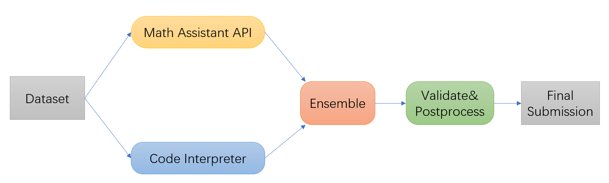

# AAAI2024 COMPETITION ON MATH PROBLEM SOLVING - TRACK1

This reposity is the solution of AAAI2024 COMPETITION ON MATH PROBLEM SOLVING for track1 by Team **CPDP-ICST** using GPT-4 API.

## Overview

### File Organization

```
track1/
│
├── dataset/
    └── TAL-SAQ7K-CN.jsonl    -    The preprocessed dataset.
├── pipeline/
    ├── code_interpreter.py    -    code interpreter api calling.
    └── math_assistant_api.py    -    math assistant api calling.
├── post_process/
    ├── generate.py    -    generate final answer.
    ├── match.py    -     merge individual result files.
    └── repeat.py    -    vote answers for duplicated questions.
├── results/    -    store the individual responses from math assistant API or code interpreter.
    ├── API/
    └── code_interpreter/
├── submission/
    └── TAL_SAQ7K_CN_prediction.zip    -    Our final submission.
├── api_requirements.txt
├── code_requirements.txt
└── readme.md
```

### Method Pipeline


We adopt model ensembling of two API-calling strategies to obtain the final results, namely the Openai official assistant API and the [code interpreter](https://github.com/shroominic/codeinterpreter-api), both of which call the gpt4-1106-preview API. Specifically, we followed these steps:

1. Use both the math assistant API and the code interpreter to solve the problem data separately.
2. Integrate the results. In our experiments, we found that the results from the math assistant API usually outperform those from the code interpreter, so in the integration, we prioritize the results from the math assistant API; if its results are invalid, we then turn to the results from the code interpreter.
3. Verify and post-process the results. This includes format validation, merging independent results, voting on repeated questions, and conversion of floating-point numbers, among others. If a result from one branch is found to be incorrect at this stage, we will use the result from the other branch.

<br/>

## Usage

### Before Replication
In this competition, we integrated the chatGPT assistant API with the results from the [code interpreter](https://github.com/shroominic/codeinterpreter-api). Given that the latter might encounter various bugs during execution and the former has relatively good performance, it is recommended to prioritize using the chatGPT assistant API for replication.

<br/>

### Install dependencies for api(Recommend)

```
conda create -y -n API python=3.9
conda activate API
pip install -r api_requirements.txt
```

<br/>

### Install dependencies for Code Interpreter

```
conda create -y -n interpreter python=3.9
conda activate interpreter
pip install -r code_requirements.txt
```
You can also refer to Code Interpreter to install the necessary dependencies.

<br/>

### Create a GPT4 Assistant(1106-preview)

visit https://platform.openai.com/assistants, and create an new assistant, 

Set name="Math Tutor", instructions="You are a personal math tutor. Write and run code to answer math questions.", set code interpreter on and model = "gpt-4-1106-preview", then copy the assistant id for the variable assistant_id in api.py

or in the api.py you can use following code to create an assistant. Pay attention not to create duplicates!

```python
assistant = client.beta.assistants.create(
    name="Math Tutor",
    instructions="You are a personal math tutor. Write and run code to answer math questions.",
    tools=[{"type": "code_interpreter"}],
    model="gpt-4-1106-preview"
)
```

<br/>

### Running: chatGPT assistant API(Recommend)
```bash
# 1. Complete the assistant_id and OPENAI_API_KEY in the math_assistant_api.py, check if the global path is correct, then run python pipeline/math_assistant_api.py to start. It may take a few days to completely obtain all the answers
python pipeline/math_assistant_api.py
# 2. Run post_process/match.py and compile the answers into result.txt
python post_process/match.py
# 3. Run post_process/generate.py to create a submission file that meets the specifications.
python post_process/generate.py
# 4. Optional: Run post_process/repeat.py to vote on the answers for repeated questions and select the most frequent one as the final answer.
python post_process/repeat.py
# 5. Post-processing: Cleanse some answers that do not conform to the float format to ensure they meet the submission standards, for example, converting "2 days" to "2".
```

<br/>

### Running: Code Interpreter
```bash
# 1. Complete the "settings.OPENAI_API_KEY" in the api.py, then run python pipeline/code_interpreter.py to start.
python pipeline/code_interpreter.py
# 2. Run post_process/match.py and compile the answers into result.txt
python post_process/match.py
# 3. Change variable "result_path" to 'results/code_interpreter/' in post_process/generate.py and run it to create a submission file that meets the specifications.
python post_process/generate.py
# 4. Optional: Run post_process/repeat.py to vote on the answers for repeated questions and select the most frequent one as the final answer.
python post_process/repeat.py
# 5. Other Post-processing: Cleanse some answers that do not conform to the float format to ensure they meet the submission standards, for example, converting "2 days" to "2".
```
<br/>

## Cost

It might cost $4-500 each method and take a few days to completely obtain all the answers for this competition's questions.

## Attention

Due to network and various other reasons, there may be instances where the GPT-4 response is empty. Simply retesting can resolve this issue.
